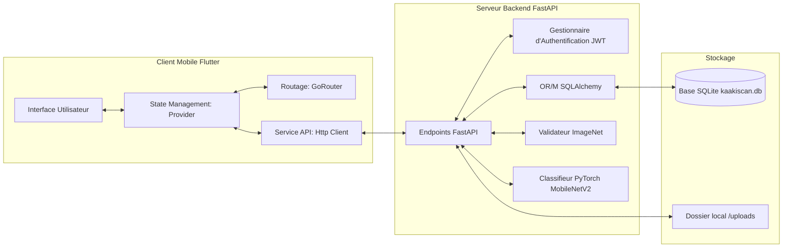

# Cahier des Charges Fonctionnel et Technique (CDCF) : Projet KaakiScan

---

## 1. Présentation Générale

### 1.1. Contexte du Projet
La maladie des cultures est l'une des causes majeures de la baisse de productivité agricole en Guinée. La banane, culture de rente et vivrière d'importance stratégique, subit de lourdes pertes dues à des pathogènes complexes à diagnostiquer sans formation spécialisée. Le projet **KaakiScan** vise à combler ce fossé en mettant les technologies d'intelligence artificielle au service des petits producteurs et des experts agricoles grâce à une application mobile simple, rapide et disponible sur le terrain.

### 1.2. Objectifs Globaux
- **Automatiser le diagnostic** : Détecter instantanément les maladies sur 4 organes du bananier (feuille, fruit, racine, tige) à partir d'une simple photo.
- **Sécuriser la plateforme** : Mettre en place une gestion des rôles et une validation des utilisateurs par un administrateur afin d'éviter le sabotage ou l'utilisation inappropriée des ressources de calcul.
- **Suivi épidémiologique** : Permettre aux agronomes et chercheurs d'avoir une vision globale des scans effectués sur le territoire pour cartographier la propagation des maladies.
- **Haute disponibilité** : Proposer un système robuste, capable de fonctionner même en mode dégradé (sans modèle IA chargé ou avec simulation stable).

### 1.3. Cibles et Rôles Utilisateurs
1. **Agriculteur (Farmer)** : Utilisateur principal. Capture des photos de ses bananiers, reçoit le diagnostic et gère son historique personnel.
2. **Agronome (Agronomist) & Chercheur (Researcher)** : Experts scientifiques. Ils accèdent à la totalité des scans effectués sur la plateforme à des fins d'analyse globale et statistique.
3. **Super Administrateur (SuperAdmin)** : Gère la plateforme, valide les inscriptions des agriculteurs et experts, modifie les rôles et suspend les comptes inactifs ou frauduleux.

---

## 2. Architecture Technique et Stack

Le projet adopte une architecture client-serveur découplée communiquant via des APIs REST standard sécurisées par JWT.



### 2.1. Client Mobile (Frontend)
- **Framework** : Flutter (Dart) pour un déploiement multiplateforme (Android et iOS).
- **Gestion d'État** : `Provider` pour maintenir et diffuser de manière fluide l'état d'authentification et l'historique des scans.
- **Routage** : `GoRouter` pour une navigation structurée par URL/chemins (Splash, Welcome, Login, Register, Home, Scan, Result, History, Profile, Admin).
- **Persistance Locale** : `SharedPreferences` pour le stockage persistant du jeton d'accès JWT de l'utilisateur.

### 2.2. Serveur Web (Backend)
- **Framework API** : FastAPI (Python) choisi pour sa rapidité d'exécution, sa génération automatique de documentation OpenAPI, et son intégration native avec l'écosystème d'IA (PyTorch).
- **Serveur ASGI** : Uvicorn.
- **Base de Données** : SQLite (via SQLAlchemy ORM) pour une installation locale légère et sans configuration complexe.

### 2.3. Moteur d'Intelligence Artificielle (Deep Learning)
- **Framework** : PyTorch (`torch`, `torchvision`).
- **Modèle de Classification Spécifique** : MobileNetV2 entraîné sur un dataset d'images de bananiers en 8 classes.
- **Modèle de Validation Sémantique** : MobileNetV2 pré-entraîné sur ImageNet pour le filtrage et le rejet d'images non conformes.

---

## 3. Spécifications Fonctionnelles

### 3.1. Gestion de l'Authentification et des Utilisateurs
- **Inscription** : Un utilisateur doit pouvoir créer un compte en saisissant son nom complet, son e-mail, son mot de passe et son rôle cible (`farmer`, `agronomist`, `researcher`).
- **Validation administrative** : À l'exception du SuperAdmin, tout compte nouvellement créé est marqué comme `is_approved = False`. L'utilisateur ne peut pas se connecter tant que le SuperAdmin n'a pas validé son compte.
- **Connexion** : Authentification via jeton JWT (OAuth2 Password Bearer). Si le compte n'est pas validé, le serveur retourne une erreur HTTP 403.
- **Profil** : Modification du nom, de l'adresse e-mail et réinitialisation sécurisée du mot de passe.

### 3.2. Module de Scan et Diagnostic IA
- **Prise de vue** : L'application permet d'importer une photo depuis la galerie ou de la prendre en direct via la caméra du smartphone.
- **Envoi et traitement** : L'image est transmise sous forme de requête multipart (`multipart/form-data`) au serveur FastAPI via l'endpoint `/api/scan`.
- **Validation de l'image** : Le serveur vérifie que la photo représente bien un bananier (feuille, fruit, racine ou tige) à l'aide du classifieur ImageNet :
  - Rejet immédiat si présence d'humains, d'animaux, d'objets du quotidien (voitures, t-shirts, ordinateurs) ou d'autres fruits/fleurs non ciblés.
  - Acceptation si présence de banane, feuille, tronc, plante, etc.
- **Inférence** : Si l'image est valide, le modèle PyTorch localisé sur le serveur identifie la classe parmi les 8 définies, calcule le score de confiance (0 à 100%) et attribue une sévérité (`low` pour sain, `medium` pour anthracnose/flétrissement, `high` pour Sigatoka/pourriture racinaire).
- **Stockage de l'image** : L'image est stockée sur le serveur dans un sous-dossier `/uploads` avec un nom unique (UUID) pour éviter les collisions.

### 3.3. Gestion de l'Historique
- **Consultation personnelle (Farmer)** : Liste chronologique décroissante de tous les scans effectués par l'utilisateur connecté avec l'image miniature, la maladie détectée, la confiance et la sévérité.
- **Suppression (Farmer/SuperAdmin)** : Suppression définitive du diagnostic en base de données et suppression physique du fichier image stocké sur le disque du serveur.
- **Accès Experts (Agronomes/Chercheurs)** : Consultation de l'ensemble des diagnostics de tous les utilisateurs de la plateforme afin de mener des études macro-agronomiques.

### 3.4. Tableau de Bord Super Administrateur (SuperAdmin Dashboard)
- Compte pré-configuré lors du démarrage de l'application (`sambrindiallo@gmail.com`).
- **Gestion des comptes en attente** : Visualisation des inscriptions en attente et validation immédiate.
- **Gestion des comptes actifs** : Suspension de comptes existants (repasse en attente de validation), modification des rôles utilisateurs, suppression définitive.
- **Modération** : Possibilité de purger les scans invalides ou inappropriés.

---

## 4. Spécifications Techniques des Données (Schéma SQL)

La base de données SQLite `kaakiscan.db` comporte deux tables principales en relation One-to-Many.

```sql
-- Table des utilisateurs
CREATE TABLE users (
    id VARCHAR PRIMARY KEY,           -- Identifiant unique généré (uid_xxxx)
    full_name VARCHAR,                -- Nom complet de l'utilisateur
    email VARCHAR UNIQUE,             -- Adresse e-mail (indexée)
    hashed_password VARCHAR,          -- Mot de passe crypté par bcrypt
    role VARCHAR DEFAULT 'farmer',    -- farmer, agronomist, researcher, superadmin
    is_approved BOOLEAN DEFAULT 0,    -- 0: en attente, 1: validé
    created_at DATETIME               -- Date de création du compte
);

-- Table des diagnostics de scan
CREATE TABLE scans (
    id VARCHAR PRIMARY KEY,           -- Identifiant unique (scan_timestamp)
    user_id VARCHAR,                  -- Clé étrangère vers users(id)
    image_url VARCHAR,                -- Chemin d'accès web vers l'image (/uploads/xxx.jpg)
    disease VARCHAR,                  -- Nom de la classe prédite (ex: Sigatoka noire)
    confidence FLOAT,                 -- Score de confiance de l'IA (entre 0.0 et 1.0)
    severity VARCHAR,                 -- Niveau de sévérité (low, medium, high)
    created_at DATETIME,              -- Date de création du diagnostic
    FOREIGN KEY(user_id) REFERENCES users(id) ON DELETE CASCADE
);
```

---

## 5. Exigences Non Fonctionnelles

### 5.1. Performance
- **Temps de réponse du diagnostic** : L'inférence du modèle d'image (validation + classification spécifique) doit s'exécuter en moins de **1.5 seconde** sur un CPU standard de serveur, et moins de **200 ms** s'il dispose d'une accélération GPU (CUDA).
- **Légèreté du client** : La taille de l'application Flutter compresse doit rester inférieure à 40 Mo pour être facilement téléchargeable en zone rurale sur réseaux 3G/4G.

### 5.2. Robustesse et Mode Dégradé
- **Simulation IA** : Si le fichier du modèle `banana_model.pth` est absent du serveur (ou corrompu), l'API FastAPI doit automatiquement basculer sur un mode simulation intelligent qui calcule un hash MD5 de l'image pour retourner un diagnostic réaliste et stable pour une même image, évitant de bloquer l'application en phase de démonstration ou de maintenance.
- **Gestion des pannes Firebase** : Le client Flutter doit encapsuler l'initialisation de Firebase dans un bloc de capture d'erreur (`try-catch`). En cas d'échec d'initialisation (absence de clés d'API), l'application doit basculer en mode de connexion directe au serveur API sans planter au démarrage.

### 5.3. Sécurité
- **Cryptage des mots de passe** : Utilisation de l'algorithme de hachage robuste **bcrypt**. Aucun mot de passe en clair ne doit transiter ni être stocké en base de données.
- **Autorisation** : Toutes les routes API (sauf inscription et connexion) requièrent l'envoi d'un en-tête HTTP `Authorization: Bearer <token_JWT>`.
- **Rôles** : L'accès à l'historique global de tous les scans (`/api/scans/all`) est restreint au niveau du serveur pour rejeter les requêtes provenant d'utilisateurs ayant le rôle de simple agriculteur (`farmer`).

---

## 6. Plan de Déploiement et Livrables

### 6.1. Livrables Attendus
1. **Code source du Backend** : FastAPI en Python avec les scripts de base de données et le fichier d'inférence PyTorch.
2. **Fichier de poids du Modèle** : Le fichier `banana_model.pth` entraîné.
3. **Code source du Client Mobile** : Application Flutter organisée en couches (services, providers, screens, routes).
4. **Notebook d'entraînement** : `kaakiscan_banana_training.ipynb` permettant de ré-entraîner ou d'affiner le modèle sur Google Colab.
5. **Documentation** : Le présent cahier des charges et le rapport scientifique associés.
